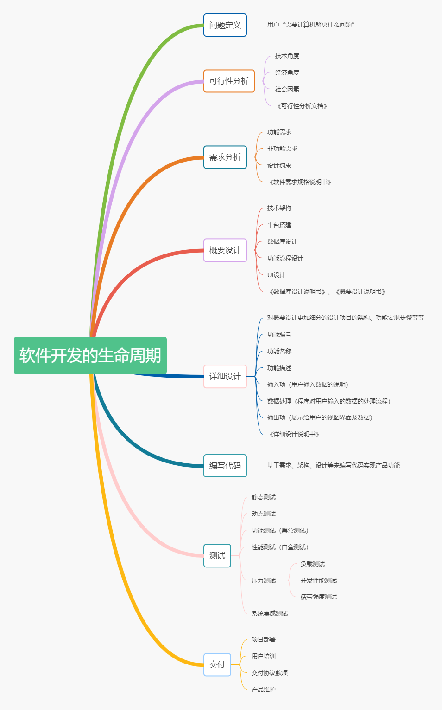
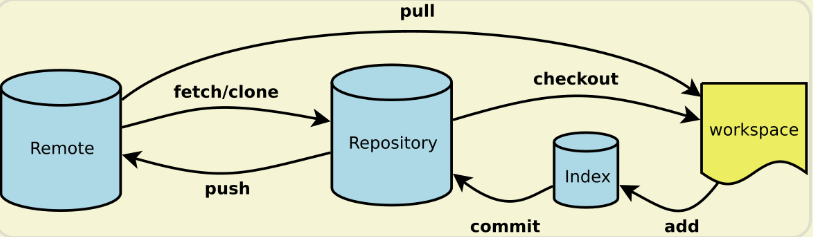
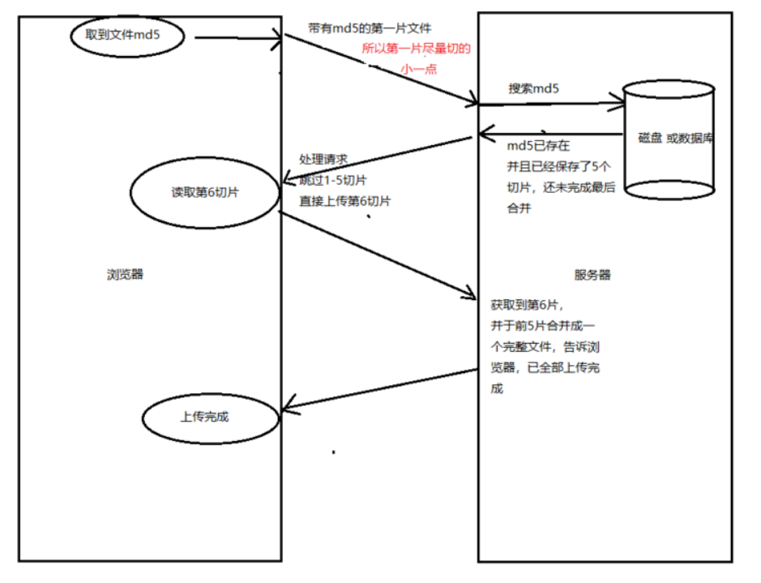
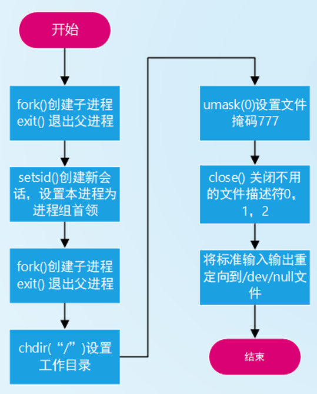

## 综合类型问题

### 自我介绍

面试官您好！我叫江宇豪，来自福建福州，现在在云南财经大学计算机专业读研二。

我这次应聘的是贵公司的C++开发实习生的岗位，然后我了解到贵公司主要从事四足机器人研发在行业内已经颇具的影响力。C++后端开发是我希望能够长期从事的方向，了解到招聘要求里要求掌握RoS操作系统，这方面我了解比较少，但是我目前能够掌握Linux的常用操作，相信通过学习能熟练掌握RoS系统的使用。并且在去年暑假我在一家公司从事C++客户端开发实习，在导师帮助下解一些BUG以及进行一些跨平台功能实现的工作，在此期间加增强了我对于软件开发这个行业的兴趣。为此，非常感谢您能给我这次面试的机会。同时我希望能够获得进入贵公司实习的机会。

---

### 反问

1. 我所应聘的岗位的**主要工作**是什么呢？
2. 对我刚刚面试过程中的表现，您能给我指出一些**不足之处和意见**吗？


---

### 简单介绍一下实习经历，你的收获是什么？

这次的实习的地方主要做的内容是C++ QT客户端的开发，产品主要是一个网盘的软件。我主要的工作是修复导师分配的解BUG任务，以及对开发的软件进行集成测试。

接下来我就介绍一下我在实习中令我印象深刻的两个任务：

第一个任务是将程序的外观修改颜色，就是在程序的QSS文件中把颜色的色值修改掉，因为QSS文件类似于CSS文件，如果代码写错了不会报错只是不显示效果，我这里用到git diff的工具找到了代码修改错误的位置。

第二个任务是这样的，复选框选中一系列选项之后，如果点击到复选框周围的部分就会取消之前选中的所有选项。**修复这个问题的方法是，编写一个原来复选框的子类**，这个子类的点击范围比原来大一圈，然后点击到复选框周围区域时触发的事件会传递到基类对象中去，从而也能选中这一项。（这里尽量可以画个图）时间大概花了两周，因为前面一直希望能够不创建新类就解决问题。

其他的工作的话就是帮助导师进行一些集成测试，然后反馈发现的问题，最重要的就是发现bug能够复现。

**实习中的收获：**

了解了软件开发的**生命周期**；

有和不同环节上的人员进行打交道，比如测试人员，美工人员，**提高了自己对于软件开发流程的认知；**

了解并学习了常见的**程序调试**方法；

学习并了解了git的基本使用，比如常见的`git pull`、`git push`、`git clone`之类的操作；在MacOS上实常会用到一些**简单的linux指令**，比如`cp`、`cd` 之类。

要持续**积累自己代码库**，这样有时候就可以复用代码，从而节省出时间做别的事。


> 可以展开的内容：
>
> - 程序调试方法要展开
> - 软件开发的生命周期


---


### 软件开发的生命周期是怎么样的呢？

https://www.cnblogs.com/ziph/p/13056286.html



1. 问题定义

   在这个阶段必须**弄清用户“需要计算机解决什么问题”**。如果在问题尚未明确的情况下就试图解决这个问题，那么就会白白浪费时间和精力，结果也毫无意义。

2. 可行性分析

3. 需求分析

   也称为软件需求分析、系统需求分析或需求分析工程等，是开发人员经过深入细致的调研和分析，准确理解用户和项目的功能、性能、可靠性等具体要求，将用户非形式的需求表述转化为完整的需求定义，从而确定系统必须做什么的过程。

4. 概要设计

   主要任务是**把需求分析得到的系统扩展用例图转换为软件结构和数据结构**。设计软件结构的具体任务是：将一个复杂系统按功能进行模块划分、建立模块的层次结构及调用关系、确定模块间的接口及人机界面等。**数据结构设计**包括数据特征的描述、确定数据的结构特性、以及**数据库的设计。**

   - 技术选型
   - 平台搭建
   - 数据库设计
   - 功能流程设计
   - UI设计

5. 详细设计

   对概要设计的一个细化，就是详细**设计每个模块实现算法**，所需的**局部结构**。在详细设计阶段，主要是通过需求分析的结果，设计出满足用户需求的软件系统产品。传统软件开发方法的详细设计主要是用结构化程序设计法。

   

6. 编写代码

7. 测试阶段

   软件的性能可以通过响应时间、并发用户数、吞吐量、资源利用率等性能指标来衡量。

   **响应时间：** 是指用户从客户端发出请求到接收完服务器返回结果的整个过程所需花费的时间，包含网络传输时间以及服务器处理时间。从用户角度来看，响应时间应该从客户端计算机处理用户操作并发出请求到客户端程序收到服务器端返回结果并显示出来的时间。

   **并发用户数：** 是指在一定时间内，某一时刻同时与服务器进行会话操作的用户数，并发用户数的类型包括：系统用户数、同时在线用户数，业务并发用户数。

   **吞吐量：** 是指单位时间内，系统处理用户的请求数或页面数量，可以直接反映出软件的承载能力。一般来说，利用每秒钟的请求数或页面数量衡量吞吐量；从业务的角度来看，也可以用每天的访问人数或每小时处理的业务数来衡量。

   **资源利用率：** 是指系统资源（CPU、内存）的利用率，通常用资源的实际使用量与总的资源可用量比值来衡量，包括网络、操作系统、数据库等方面。

8. 交付和维护

---


### 有没有一些解决问题（或BUG）的心得方法？

#### 解决问题的方法论

https://zhuanlan.zhihu.com/p/31947554

https://dbaplus.cn/news-149-3652-1.html

1. **明确和理解问题**

   第一步，找到需求方关心的问题点；

   第二步，明确解决问题的目标；

   第三步，明确可以用来解决问题的资源。

2. **拆分和定位问题（最重要）**

   **定义到元问题**。生活当中遇到的大部分问题都是所谓的复杂问题，而不是元问题。复杂问题就是掺杂了多个维度和变量的问题，**元问题就是最本质最细小的待解决的问**题。

   拆分的时候可以采用**假设**的方法；

   拆分的时候要把问题尽量拆分到底，即遵循**完全穷尽，相互独立**。

3. **提出解决方案**

   按照缓急轻重逐一解决子问题。

4. **总结问题**

#### 解决BUG的方法和心得

解决bug一般是分为以下的六个步骤：

- **了解bug**。我们首先需要到底出了什么bug，现象是什么，怎样发生的；
- **复现bug**。在了解了bug的大致情况之后，我们需要能够找到复现的路径，这就为后面bug的定位提供可靠的依据；
- **定位bug（最重要）**。当有了稳定的复现途径之后，要做的就是打断点、打日志进行调试，来一步一步分析和定位bug，到底是那块代码导致的错误；
- **确认bug**。当我们定位到bug出错的地方之后，我们就需要分析这到底是不是bug。如果是bug，那么这个bug出现的根源是什么，到底能不能解决；
- **修复bug**。在明确了bug的根本原因之后，下面就需要发挥我们的聪明才智去修复这个bug了；
- **验证bug**。并不是每次我们修复完bug之后就可以万事大吉了，此时我们还需要去重现bug以确保bug被真正修复。除此之外，有条件的我们还需要去验证相关场景，以保证修复该bug不会引入其他bug。


**定位bug的方法有如下几点：**

> 记标题和加粗

- **断点调试**法。

- **日志分析**法。其实并不是所有bug都可以进行断点调试的。比如在一些**循环调用或者业务较为复杂**的场景下，打日志分析定位是较为适合的方式；

- **排除法**。如果一个bug产生的原因可能有多种情况的时候，这个时候采取排除法的方式是最优的。你可以把可能导致bug产生的代码块都打上日志或者断点，然后重现一下bug进行问题的定位；

- **代码回滚**法。

  > 如果你这个bug在之前的版本是好的，但是在现在版本上又出现了，这个时候就可以使用代码回滚大法。把你的代码回滚到你怀疑的版本，运行看bug是否消失，然后对两个版本之前代码有何区别，最终定位出bug产生的位置。这里我们可以使用二分法来提高代码的回滚效率；

  

- **注释（删除）代码法**。对于一些难以理解和定位的bug，可以使用这个方法进行尝试。

  > 不过这个方法使用起来有一定的风险，因为可能你删除的那一串代码虽然能够解决bug，但是却不是bug产生的根源，这个时候你可能会将必现bug改成了偶现bug，让问题变得更加复杂；

   

- **源码分析**法。

  > 有的时候有些bug可能并不是你的代码导致的问题。可能是第三方库本身的bug，又或者是系统本身的bug，又或者是你误用api导致的问题，这个时候就需要你拥有源码分析的能力。深入源码中，一层层分析直到最终找到bug产生的原因；

  

- **联想**法。

  > 通过一些类似的bug修改经验从而联想猜测出bug产生的位置。这个方法对使用者本身有较高的要求。需要使用者对项目代码和业务逻辑非常熟悉，同时对问题分析的能力有较高的要求。这就是我们常说的牛人能够一眼就能看出问题，他们常用的就是这种方式；

  

- **场外支援**法。

  > 这是实在定位不出bug才采取的下下策。因为它并不能提高你定位bug的能力，同时请别人帮忙定位bug，**你就需要把你之前所做的工作都要全盘地向他表述一遍，这样不仅会降低bug修复的效率，**同时还不一定能保证定位出bug产生的位置，它取决于你表述问题的能力和帮你的人分析和解决问题的能力。

---


### 你有什么调试的心得和方法吗？

https://www.jianshu.com/p/ea22a699e456

> 单独去学一下gdb调试方法


先介绍一些我知道的常见的gdb调试方法：

一般一个窗口gdb调试，另一个窗口看源代码

编译程序的时候需要加上`-g`参数，

```sh
g++ -o -g test test.cpp
```

**常用命令：**

| 调试命令             | 含义                                                         |
| -------------------- | ------------------------------------------------------------ |
| list / l   行号      | 从某一行开始往下显示，一次显示10行。l 2：表示从第二行开始显示10行的内容。 |
| list / l   函数名    | 显示某个函数的源码。l  main：显示main函数的全部内容          |
| **run / r**          | **运行程序，遇到断点会停下来**                               |
| **next / n**         | **单行执行**                                                 |
| **step / s**         | **进入函数调用**                                             |
| **backtrace / bt**   | **查看各级函数的调用及参数（相当于VS中的调用堆栈）**         |
| **display  变量名**  | **跟踪查看一个变量，每次停下来都显示它的值**                 |
| **info break**       | **查看断点信息**                                             |
| **break /b 行号**    | **在某一行设置断点**                                         |
| delete breakpoints n | 删除序号为 n 的断点，注意是序号，不是行号（使用info break查看断点序号） |
| delete breakpoints   | 删除所有断点                                                 |
| **finish**           | **执行完当前函数停下来**                                     |
| **continue /c**      | **直接到达下一个断点**                                       |
| **until  行号**      | **直接跳转到指定行。until 5：跳转到第5行**                   |
| set args             | 设置程序运行参数，如./hello jack 等价于$ gdb ./hello; set args jack; run |

**调试core文件**

要先设置core文件大小为`unlimited`才能生成core文件

```sh
ulimit -c unlimited #core file size设置为unlimited
```

假设生成的code文件名为 `core.2231`,用core文件的调试方法为

```sh
gdb ./hello core.2231 #./hello为崩溃的可执行程序
```

**进程run调试一个正在运行的进程**

首先，先编写一个不断执行的程序（如循环程序）,如下为 hello.c

```
#include <stdio.h>
#include <unistd.h>

int main(int argc, char **argv)
{
    for(int i = 0; i <= 100; ++i) {
        sleep(1);
        printf("hello,world : %d\n", i);
    }    
    return 0;
}
```

进行编译

```sh
gcc -g -o hello hello.c
```

分别开两个窗口，一个执行程序，一个调试

```sh
#窗口1
./hello
#窗口2
ps -ef|grep hello #获取进程号，如12776
gdb -p 12776 #根据进程号调试正在运行的程序,然后回车按两下，就进入调试了
```


**多进程调试命令**
默认情况下，gdb跟踪的是父进程，如果要查看gdb的跟踪状态，可以输入

```sh
show follow-fork-mode      # 查看当前 gdb 的跟踪状态
```

如果要跟踪子进程，可以输入

```sh
set follow-fork-mode child      # 跟踪子进程
```

如果要重新跟踪父进程，可以输入

```sh
set follow-fork-mode parent # 跟踪父进程
```


**进程间切换**

gdb默认只跟踪一个进程，要实现进程间切换，需要让两个进程都在gdb控制下。输入下面指令，一个进程会处于调试状态(follow-fork-mode决定)

```sh
set show detach-on-fork off		#让父子进程都在gdb控制下
```

查看当前进程信息

```sh
info inferiors
```

切换到指定进程

```sh
inferiors  进程序号
```


还有一些我在写代码过程中会用到的调试方法：

1. assert断言

   在程序中插入assert 断言可以让程序出现意料之外的结果的时候，立刻宕机并输出coredump文件。在开发的时候，这是一个非常有用的机制帮助定位bug。

2. 日志模块

   > 加log来排查问题是最常见有效的定位bug的思路了，一个靠谱，高效，稳定的日志模块是一个系统最基础的组件了。

3. 断点调试

4. 内存泄漏定位

   一般有如下几种方法：

   - 发现内存泄露，比如收到**机器的内存告警**，oom发生，或者其他监控日志触发告警。
   - 从内存泄露的机器上定位到具体哪个进程发生了泄露。
     a) **top**看看有没有**内存占用异常高**的进程
     b) oom被kill掉的进程并不一定是内存泄露的进程，虽然大概率是。
     c) 最好每个进程加上监控日志，每隔一段时间把自己的meminfo打印出来，这样就可以查日志，看到每个进程内存的变化。持续走高的进程就是问题所在了。
   - **valgrind** 挂在可疑进程上，使用工具跑一下。（如果是一个小项目或者是简单的工具类程序，那么发现问题的概率是比较高的，如果一无所获，那就继续排查）
   - 如果不能发现问题，接下来查看**内存池日志**，寻找各种对象的分配的数量和最大使用数量。如果运气好找到了泄露的对象，根据泄露的对象，进一步缩小范围，找到分配对象的函数。（一般来说可以在分配对象的信息里面带上申请对象的`__FILE__` 和` __FUNCTION__ `这样就可以轻松找到对象是被从哪里被分配出来的)
   - 如果还没找到，那么可以`LD_PRELOAD`动态库去hook malloc函数，或者grep new/malloc等关键字，或者`strace `进程 看看有没有申请内存异常系统调用等。`address sanitizer`工具（如果gcc版本支持的话）也可以挂上去跑跑看，这个对性能的影响比较小。

5. CPU高负载定位

   - 收到机器cpu告警，确认一下是**瞬间cpu出现峰值**，还是**持续cpu出现峰值**。
     找到机器上跑满cpu的进程
     a) 对于**持续跑满**的情况下，top看看就知道了
     b) 对于**瞬间跑满**的情况，登录到机器上面的时候，cpu可能已经正常了。每个进程可以加上周期性的打印出自己的cpu负载情况。这样看日志就可以找到问题进程。
   - 如果是持续很高，很有可能是死循环，可以**pstack pid**打印出进程的**bt**或**gdb attach**上去bt几次，如果都是同一个bt的话，那就是在这个逻辑里面死循环了。
   - 如果不是持续很高：
     a) 找到cpu出现异常高的时间段，看看这样时间内发生了什么。比如，是否是收到了**大量的外部请求**，是否是**定时任务大量同时到**期，日志里面是否有可疑的日志。
     b) 对于线上环境，可以使用预先给关键函数，入口函数，消息驱动函数等插入记录执行时间的统计日志。（比如统计每个rpc的平均请求数/平均处理时间，查询db的请求数/出处理时间，定时器等逻辑）如何关于如何统计函数的执行时间 有了这个日志，对定位问题有极大的帮助。
     c) 一般来说上一步就可以定位问题了，或者可以定位问题的大概范围。可以进一步**插入统计日志**来精确定位。如果还不行，那可以结合业务分析分析，比如这段时间有什么特殊业务等。
     d) 定位问题后，可以结合各种性能测试工具比如pert，vtune等工具，针对性的构建测试环境和用例，进一步的验证和复现问题。

6. 内存越界定位

7. 崩溃的时候可以试图捕获信号，signal

8. linux排查问题命令小结

   对于log文件，结合各种查找命令找到关键字

   **grep命令**：

   ```sh
   // 从out.log文件中 查找 hello
   grep hello out.log
   
   // 从out.log文件中 查找hello ，忽略大小写
   grep -i hello out.log
   
   // 递归查找
   grep -rn hello out.log
   
   // 排除
   grep hello out.log | grep -v world
   
   // 显示匹配到的周围几行    这个太方便的了 ！！！！
   grep xxxx  -C4
   ```

   **grep与正则表达式结合使用**

   ```sh
   // 正则表达
   // 日志中查hello 或 world的关键字
   grep "hello\|world" out.log
   
   //  cat out.log
   uid 10001 age 9
   uid 10002 age 10
   uid 10003 age 19
   uid 10004 age 20
   
   // 匹配一个区间
   $ grep 'uid 1000[2-3]' out.log
   uid 10002 age 10
   uid 10003 age 19
   ```

   **find命令**

   ```sh
   // 匹配是xml的文件 （会递归查找下去）
   find . -name "*.xml*"
   
   // 忽略大小写
   find . -iname "*uid.xml*"
   ```

9. 使用更加严格的编译检查

```sh
# 任何的告警都会被认为错误
g++ -Wall -Werror test.cpp -o test

# 不过如果有依赖一个有warning的库或者是warning太多积重难返
# 可以针对一些重要waring认为是错误
g++ -Wall -Werror=shadow -Werror=maybe-uninitialized -Werror=return-type -Werror=unused-but-set-variable test.cpp -o test
```


---

### 常用git指令有哪些，git遇到冲突如何解决？【TODO】

> 详细参考：https://www.ruanyifeng.com/blog/2015/12/git-cheat-sheet.html



- Workspace：工作区
- Index / Stage：暂存区
- Repository：仓库区（或本地仓库）
- Remote：远程仓库

#### 操作说明

- `git add [file1] [file2] ... `     // 添加指定文件到暂存区
- `git commit -m [message]`   // 提交暂存区到仓库区
- `git commit --amend`  // 相同功能多次提交复用上次信息
- `git fetch [remote]`    // **下载远程仓库**的所有变动
- `git pull [remote] [branch]`   // **取回远程仓库**的变化，并于本地分支合并
- `git push [remote] [branch]`   // 上传本地分支到远程仓库
- `git checkout [file] `  // **恢复**暂存区（index）的指定文件到工作区

#### git遇到冲突的解决方法

冲突产生原因是不同分支修改了同一文件的同一行

**方法一**

- 修改冲突文件 vi
- `git add . ` // 添加到暂存区
- `git commit . -i -m ""` // 添加冲突解决的信息
- `git checkout master` 切换到【本地】master分支
- 把自己的开发分支合并到本地master分支上 `git merge develop `

- 推送到远端master分支上  `git push origin master`

**方法二**

---

### 请简单介绍一下区块链整个架构体系[TODO]

《区块链技术：架构及进展》

### 你的职业规划是什么？[TODO]


---


## 设计模式

### 有学过一些设计模式吗,介绍一下？

#### 模板方法

定义一个操作中的**算法的骨架** ，而将一些步骤延迟到子类中。 Template Method使得子类可以不改变一个算法的结构即可重定义该算法的某些特定步骤。

> 背景：
>
> 某个品牌动物园，有一套固定的表演流程，但是其中有若干个表演子流程可创新替换，以尝试迭代更新表演流程；

要点：

- 最常用的设计模式，**子类可以复写父类子流程**，使父类的骨架流程丰富；
- **反向控制流程**的典型应用；
- 父类 protected 保护子类需要复写的子流程；这样子类的子流程只能父类来调用；

本质：

- 通过固定算法骨架来约束子类的行为。


#### 观察者模式

定义对象间的一种**一对多（变化）的依赖关系**，以便当一个对象(Subject)的状态发生改变时，所有依赖于它的对象都得到通知并自动更新，常见于**发布订阅**的功能。 

> 背景:
> 气象站发布气象资料给数据中心，数据中心经过处理，将气象信息更新到两个不同的显示终端（A和B）；

**要点:**

- 观察者模式使得我们可以**独立地改变目标与观察者**，从而使二者之间的关系**松耦合**；
- 观察者自己决定是否订阅通知，目标对象并不关注谁订阅了；
- 观察者不要依赖通知顺序，目标对象也不知道通知顺序；
- 常用在**基于事件的ui框架**中，也是 MVC 的组成部分；
- 常用在**分布式系统中、actor框架**中；
- **智能指针**也有观察者模式影子， 被绑定的对象是被观察者。
- **线程池**也用到观察者模式。

**本质:**

- **触发联动**

#### 策略模式

定义一系列算法，把它们一个个封装起来，并且使它们可互相替换。该模式使得算法可独立于使用它的客户程序而变化。 

> 某商场节假日有固定促销活动，为了加大促销力度，现提升国庆节促销活动规格；

要点:

- 策略模式提供了一系列**可重用**的算法，从而可以使得类型在运⾏时方便地根据需要在各个算法之间进行切换；
- 策略模式**消除了条件判断**语句；也就是在**解耦合**；

本质

- 分离算法，选择实现；

#### 单例模式

**保证一个类仅有一个实例，并提供一个该实例的全局访问点。**

单例模式默写

```cpp
class Singleton
{
public:
    static Singleton& GetInstance(){
        
        static Singleton instance;//存储在静态全局区
        return instance;
    }

private:
    Singleton(){}
    ~Singleton(){}
    Singleton(const Singleton&){}
    Singleton& operator=(const Singleton&){}
};
```

##### 优点

- 静态局部变量特性：延迟加载
- C++11**静态局部变量初始化**时，具备线程安全
- 静态局部变量特性：系统**自动回收内存，**自动调用析构函数
- 静态局部变量初始化时，没有new操作带来的cpu指令reorder操作


#### 工厂方法

定义一个用于**创建对象的接口**，让子类决定实例化哪一个类。Factory Method使得一个**类的实例化延迟到子类**。 

> 背景
> 实现一个导出数据的接口，让客户选择数据的导出方式；

要点

- 解决创建过程比较复杂，希望对外隐藏这些细节的场景；
- 比如连接池、线程池
- 隐藏对象真实类型；
- 对象创建会有很多参数来决定如何创建；
- 创建对象有复杂的依赖关系；

本质

- 延迟到子类来选择实现；


#### 抽象工厂

提供一个接口，让该接口负责创建一系列“相关或者相互依赖的对象”，无需指定它们具体的类。

> 如：实现一个拥有导出导入数据的接口，让客户选择数据的导出导入方式；


#### 责任链

使多个对象都有机会处理请求，从而避免请求的**发送者和接收者之间的耦合关系**。将这些对象连成一条链，并**沿着这条链传递请求**，直到有一个对象处理它为止。 

> 背景:请求流程，1 天内需要主程序批准，3 天内需要项目经理批准，3 天以上需要老板批准；
>
> 天数和链条长度是变化点，处理模式是稳定点
> 稳定点进行抽象
> 变化点进行扩展
>
> nginx中就有用到责任链模式

要点

- **解耦请求方和处理方**，请求方不知道请求是如何被处理，处理方的组成是由相互独立的子处理构成，子处理流程通过链表的方式连接，子处理请求可以按任意顺序组合；
- 责任链请求强调**请求最终由一个子处理流程处理**；通过了各个子处理条件判断；
- 责任链扩展就是**功能链**，功能链强调的是，一个请求依次经由功能链中的子处理流程处理；
- 将职责以及职责顺序运行进行抽象，那么职责变化可以任意扩展，同时职责顺序也可以任意扩展；

本质

- 分离职责，动态组合；


#### 装饰器

动态地给一个对象**增加一些额外的职责**。就增加功能而言，装饰器模式比生产子类更为灵活。

> 背景
> 普通员工有销售奖金，累计奖金，部门经理除此之外还有团队奖金；后面可能会添加环比增长奖金，同时可能针对不同的职位产生不同的奖金组合；
>
> 分析：
>
> 员工类型是变化点；
>
> 增加奖金规则是稳定点

要点

- 通过采用**组合而非继承**的手法， 装饰器模式实现了在**运行时动态扩展对象功能**的能力，而且可以根据需要扩展多个功能。 避免了使用继承带来的“灵活性差”和“多子类衍生问题”。
- 不是解决“多子类衍生问题”问题，而是解决“父类在多个方向上的扩展功能”问题；
- 装饰器模式把一系列**复杂的功能分散到每个装饰器**当中，一般一个装饰器只实现一个功能，实现**复用装饰器**的功能；

本质

- 动态组合

---


### 类的封装或设计上你有没有什么设计思想？

> 取自课程笔记

#### 依赖倒置

- 高层模块不应该依赖低层模块，两者都应该依赖抽象；
- 抽象不应该依赖具体实现，具体实现应该依赖于抽象；

#### 开放封闭

- 一个类应该对扩展（组合和继承）开放，对修改关闭；

#### 面向接口

- 不将变量类型声明为某个特定的具体类，而是声明为某个接口；

- 客户程序无需获知对象的**具体类型**，只需要知道对象所具有的**接口**；

  > 如提供用户setName() 和getName()方法，而不提供mName属性

- 减少系统中各部分的**依赖关系**，从而实现**“高内聚、松耦合”**的类型设计方案；

#### 封装变化点

- 将稳定点和变化点分离，扩展修改变化点；让稳定点和变化点的实现层次分离；


#### 单一职责

- 一个类应该仅有一个引起它变化的原因；

#### 里氏替换

- **子类型必须能够替换掉它的父类型**；主要出现在子类覆盖父类实现，原来使用父类型的程序可能出现错误；覆盖了父类方法却没有实现父类方法的职责；

#### 接口隔离

- 不应该强迫客户依赖于它们不用的方法；
- 一般用于处理一个类拥有比较多的接口，而这些接口涉及到很多职责；

#### 组合优于继承

继承耦合度高，组合耦合度低；

---

### 请写出一个单例模式【TODO】


---


### 平时有玩游戏吗？平时业余做什么（有什么爱好）？

大三后面就很少玩了，玩多了可能前面很多问题就答不上来了~~~；业余的话基本是看看书或者电影，平时会跑跑步。  没开校园网，只能手机开热点，网络不稳定，故不玩了。哈哈哈


### 你为什么要重复造轮子

因为这样应该对实际运用有帮助，一方面是温习之前学过的知识，或者我希望进一步扩张其功能。


## 编程语言


### C++线程的创建方法

直接调用`std::thread`,该线程拿到任务后立即开始执行

```c++
#include <iostream>
#include <thread>

using namespace std;

void helloFunction()
{
    std::cout << "Hello C++11 from function." << std::endl;
}

class HelloFunctionObject
{
public:
    void operator()() const
    {
        std::cout << "Hello C++11 from a function object." << std::endl;
    }
};

int main()
{
    std::cout << std::endl;

    // 线程执行函数 helloFunction
    std::thread t1(helloFunction);

    // 线程执行函数对象 helloFunctionObject
    HelloFunctionObject helloFunctionObject;
    std::thread t2(helloFunctionObject);

    // 线程执行 lambda function
    std::thread t3([]
                   { std::cout << "Hello C++11 from lambda function." << std::endl; });

    // 确保 t1, t2 and t3 在main函数结束之前结束
    t1.join();
    t2.join();
    t3.join();

    std::cout << std::endl;
};
```

---


### C++中struct和class的区别

- 相同点
  - 两者都拥有成员函数、公有和私有部分
  - 任何可以使用class完成的工作，同样可以使用struct完成
- 不同点
  - 两者中如果不对成员不指定公私有，**struct默认是公有的**，**class则默认是私有的**
  - class默认是private继承，而struct模式是public继承

**引申：C++和C的struct区别**
C语言中：struct是用户自定义数据类型（UDT）；

C++中struct是抽象数据类型（ADT），支持成员函数的定义，（C++中的struct能继承，能实现多态）
**C中struct是没有权限的设置的**，且struct中只能是一些变量的集合体，可以封装数据却不可以隐藏数据，而且成员不可以是函数
C++中，struct增加了访问权限，且可以和类一样有成员函数，**成员默认访问说明符为public**（为了与C兼容）
struct作为类的一种特例是用来自定义数据结构的。一个结构标记声明后，在C中必须在结构标记前加上struct，才能做结构类型名（除：typedef struct class{};）;

C++中结构体标记（结构体名）可以直接作为结构体类型名使用，此外结构体struct在C++中被当作类的一种特例

---

### vector动态扩容为什么是原容量的1.5倍或2倍？

- 根据查阅的资料显示，考虑可能产生的**堆空间浪费**，成倍增长倍数不能太大，使用较为广泛的扩容方式有两种，以2二倍的方式扩容，或者以1.5倍的方式扩容。
- 以2倍的方式扩容，导致**下一次申请的内存必然大于之前分配内存的总和，导致之前分配的内存不能再被使用**，所以最好倍增长因子设置为(1,2)之间。

**总结：**

也就是为了能够更好的**复用之前分配的内存**。


---

### 智能指针shared_ptr实现

**关键点**：

1. 应用**模板类**
2. 对**普通指针**的封装
3. **拷贝构造**使得引用计数+1
4. **拷贝赋值**使得左边对象引用计数-1，右边引用计数+1

```c++
template <typename T>
class SharedPtr
{
public:
    SharedPtr(T *ptr = NULL) : _ptr(ptr), _pcount(new int(1))
    {
    }
    SharedPtr(const SharedPtr &s) : _ptr(s._ptr), _pcount(s._pcount)
    {
        (*_pcount)++;
    }
    SharedPtr<T> &operator=(const SharedPtr &s)
    {
        if (this != &s)
        {
            if (--(*(this->_pcount)) == 0)
            {
                delete this->_ptr;
                delete this->_pcount;
            }
            _ptr = s._ptr;
            _pcount = s._pcount;
            *(_pcount)++;
        }
        return *this;
    }
    T &operator*()
    {
        return *(this->_ptr);
    }
    T *operator->()
    {
        return this->_ptr;
    }
    ~SharedPtr()
    {
        --(*(this->_pcount));
        if (*(this->_pcount) == 0)
        {
            delete _ptr;
            _ptr = NULL;
            delete _pcount;
            _pcount = NULL;
        }
    }

private:
    T *_ptr;
    int *_pcount; //指向引用计数的指针
};
```

---

### map查找的时间复杂度

unordered_map 是用哈希表实现的，插入和查询时间复杂度为$O(1)$

map的查找操作的时间复杂度为O(logN)，其中N是map中元素的数量。map内部采用了红黑树存储元素，因此查找操作的时间复杂度取决于红黑树的高度，一般来说红黑树的高度与元素个数之间呈对数关系，即高度为logN。因此map的查找操作的时间复杂度为O(logN)。


### 请简述几个你了解的C++11的特性

> 参考资料：https://blog.csdn.net/jiange_zh/article/details/79356417


#### 类型推导

C++11 引入了` auto` 和 `decltype `这两个关键字实现了类型推导，省去了自己判断类型的工作。

#### lambda表达式

lambda表达式是一种可以创建**匿名函数**的语法，通常用在需要传入一个处理函数，且这个处理函数比较小且仅针对一个功能使用的时候，比如排序或者查找算法中。

#### 范围for循环

它可以用来遍历数组、容器或者任何可迭代对象的元素，而**不需要手动指定迭代器**。使用场景：用于遍历STL容器中的元素，比如vector、map等。

#### std::move和右值引用的作用

左值是一个**可以寻址**的变量，而右值是一个**临时的、不可寻址**的表达式。

右值引用的主要用途是实现**移动语义**。

移动语义是一种新的语义，它允许我们在将资源转移给新对象的同时，**避免不必要的复制和内存分配**。移动语义的实现需要利用右值引用和移动构造函数或移动赋值运算符。

使用右值引用和移动语义可以避免在**创建新对象**或将资源**从一个对象移动到另一个对象**时进行不必要的复制和内存分配，从而提高程序的性能和效率

std::move仅仅是简单地**将左值转换为右值**，它本身并没有转移任何东西。它仅仅是让对象可以转移。

#### emplace_back原地构造

使用`push_back()`向容器中加入一个右值元素(临时对象)时，首先会调用构造函数**构造这个临时对象**，然后需要调用拷贝构造函数将这个临时对象放入容器中。原来的临时变量释放。这其中调用了**1次普通构造函数+1次拷贝构造**

而使用`emplace_back()`则只需要调用一次移动或拷贝构造函数

**总结**

- `emplace_back(int num)` 只会调用一次移动构造或拷贝构造
- 结合move语义，将类对象变量转变为右值，`push_back(std::move(Person p))` 或 `emplace_back(std::move(Person p))` 只会调用一次移动构造或拷贝构造


#### 智能指针

一个对象可以被多个`shared_ptr`指向， 但只能被一个`unique_ptr`指向；

智能指针减少了手动`delete`分配过的内存的精神负担；

`weak_ptr`是辅助`shared_ptr`使用的，析构不会减少引用计数。

#### nullptr

`nullptr`为了替代 `NULL`,`NULL`有时候不大清楚是`(void*)0 `还是数值0。

C++11 引入了 `nullptr `关键字，专门用来区分空指针、0。

#### 构造函数初始化列表

#### 其他特性

STL中的emplace_back（原地构造）

高阶特性：

正则表达式库`regexp`

thread(线程库)、 condition、mutex

atomic

function、bind

异常

协程

---


## 计算机网络

### 在浏览器地址栏键入URL，按下回车之后会经历哪些流程

1. 浏览器向 **DNS** 服务器请求解析该 URL 中的域名所对应的 IP 地址;
2. 解析出 IP 地址后，根据该 IP 地址和默认端口 80，**和服务器建立TCP连接;**
3. 浏览器**发出读取文件(URL 中域名后面部分对应的文件)的HTTP 请求**，该请求报文作为 **TCP 三次握手的第三个报文的数据**发送给服务器;
4. 服务器对浏览器请求**作出响应，**并把对应的 html 文本发送给浏览器;
5. 释放 TCP连接;
6. 浏览器解析html代码，并请求html代码中的资源，最后对页面进行渲染呈现给用户。


### 介绍一下HTTP协议（！！！）

HTTP协议是Hyper Text Transfer Protocol（**超文本传输协议**的缩写），是用于从万维网服务器传输超文本到本地浏览器的传送协议。HTTP**基于TCP/IP**通信协议来传递数据

#### HTTP工作原理

HTTP协议工作于**客户端-服务器**架构上，浏览器作为HTTP客户端通过URL向HTTP服务端即WEB服务器发送所有请求。

WEB服务器有：Apache服务器，IIS服务器（Internet Information Services）等

Web服务器根据收到的请求后，向客户端发送响应信息。

HTTP默认**端口号为80**，但也可以改为8080或其他端口

#### HTTP注意事项

- HTTP是**无连接**的：无连接的含义是限制**每次只处理一个请求**。服务器处理完客户的请求，并收到客户应答后，即断开连接。采用这种方式可以节省传输时间。
- HTTP是**媒体独立**的：这意味着，只要客户端和服务器知道如何处理数据内容，任何数据类型都可以通过HTTP发送。客户端以及服务器指定使用合适的MIME-type内容类型。
- HTTP是**无状态**的：无状态协议是指**对于事务处理没有记忆能力**。缺少状态意味着如果后续处理需要前面的信息，则必须重传，这样可能导致每次传输的数据量增大。另一方面，在服务器不需要先前信息时它的应答就比较快。

---

### HTTP有哪些状态码，分别什么意思？

- `1xx` 类状态码属于**提示信息**，是协议处理中的一种**中间状态**。用的少，**post**第一次请求会收到100状态码的报文。

- `2xx`类状态码表示服务器**成功**处理了客户端请求。

  - `200 OK`，表示一切正常，若为非`HEAD`请求，服务器返回的**响应头都有body数据**
  - `204 No Content` ，与200 OK基本相同，但响应头**没有body数据**。
  - `206 Partial Content `是应用于HTTP**分块下载或断点续传**，表示响应返回的body数据并不是资源的全部，而是其中的一部分，也是服务器处理成功的状态。

- `3xx`类状态码表示客户端请求的**资源发生了变动**，需要客户端用新的URL重新发送请求获取资源，即**重定向**。

  - `301 Moved Permanently`表示**永久重定向**，说明请求的资源已经不存在了，需改用新的URL再次访问。

  - `302 Found`表示**临时重定向**，说明请求的资源还在，但暂时需要用另一个URL来访问。

    > 301和302都会在响应头里使用字段Location ，指明后续要跳转的URL，浏览器会自动重定向新的URL。

  - `304 Not Modified`不具有跳转的含义，表示资源未修改，重定向已存在的缓冲文件，也称**缓存重定向**，用于缓存控制。

- `4xx`类状态码表示**客户端发送的报文有误**，服务器无法处理，也就是错误码的含义。

  - `400 Bad Request`表示客户端**请求的报文有错误**，但只是个笼统的错误。
  - `403 Forbidden`表示**服务器禁止访问资源**，并不是客户端的请求出错
  - `404 Not Found`表示**请求的资源在服务器上不存在或未找到**，所以无法提供给客户端。

- `5xx`类状态码表示客户端请求报文正确，但是**服务器处理时内部发生了错误**，属于服务器端的错误码。

  - `500 Internal Server Error`与400类型，是个笼统**通用的错误码**，服务器发生了什么错误，我们并不知道。
  - `501 Not lmplemented`表示客户端请求的**功能还不支持，**类似“即将开业，敬请期待”的意思。
  - `502 Bad Gateway`通常是服务器作为网关或代理时返回的错误码，表示服务器自身工作正常，**访问后端服务器发生了错误**。
  - `503 Service Unavailable`表示**服务器当前很忙**，暂时无法响应服务器，类似“"网络服务正忙，请稍后重试”的意思。

---

### get和post请求的区别

1. get请求一般是去取**获取**数据（其实也可以提交，但常见的是获取数据）；
   post请求一般是去**提交**数据。
2. get因为参数会放在**url中**，所以隐私性，安全性较差，**请求的数据长度是有限制的**，不同的浏览器和服务器不同，一般限制在 2~8K 之间，更加常见的是 1k 以内；
   post请求是没有的长度限制，请求数据是放在body中；
3. get请求刷新服务器或者回退没有影响，post请求回退时会重新提交数据请求。
4. get请求可以被缓存，post请求不会被缓存。 **故get效率会高一些。**
5. get请求会被保存在浏览器历史记录当中，post不会。**get请求可以被收藏为书签，因为参数就是url中**，但post不能。它的参数不在url中。
6. get请求只能进行**url编码**（appliacation-x-www-form-urlencoded）；
7. post请求支持多种（multipart/form-data等）。

**细节**

1.GET 和 POST都是http请求方式， 底层都是 TCP/IP协议；通常GET 产生一个 TCP 数据包；**POST 产生两个 TCP 数据包**（但firefox是发送一个数据包），

2.对于 GET 方式的请求，浏览器会把 **http header 和 data** 一并发送出去，服务器响应 200（返回数据）表示成功；

而对于 **POST，浏览器先发送 header，服务器响应 100， 浏览器再继续发送 data，服务器响应 200 （返回数据）。**


---


### epoll比select和poll高效，那么高效的原因是什么？

1. **epoll采用的是边沿触发的方式**，而select和poll采用的是水平触发的方式。**边沿触发的方式可以避免循环检测所有文件描述符的性能消耗**，因此epoll的效率更高。
2. select和poll采用的是**轮询**方式检测就绪就绪事件$O(n)$，而epoll采用的是**回调**的方式来检测就绪事件$O(1)$。
3. epoll采用了**基于内核的事件通知机制**，因此它不需要**内核与用户空间之间频繁地数据交换**，避免了上下文切换带来的性能消耗。而select和poll需要在**用户空间和内核空间之间频繁地传递文件描述符集合**，导致效率较低。
4. select，poll实现需要自己不断轮询所有fd集合，直到设备就绪，期间可能要睡眠和唤醒多次交替。而**epoll只要判断一下就绪链表是否为空**就行了，这节省了大量的CPU时间。

综上所述，epoll的高效主要是由于它采用了**边沿触发**的方式，并且使用了**基于内核的事件通知机制**，避免了频繁地在用户空间和内核空间之间传递数据的性能消耗。


---

### epoll相比select和poll一定是最快的吗？

不一定，epoll的一个缺点就是 **当事件触发比较频繁时，回调函数也会被频繁触发**，此时效率就未必比select或poll高。

所以epoll最佳的使用场景是：**连接数量多，但是活跃的连接数少的情况。**


---


### Reactor和Proactor的区别

Reactor 可以理解为「来了事件操作系统通知应用进程，让应用进程来处理」，而 Proactor 可以理解为「来了事件操作系统来处理，处理完再通知应用进程」。

无论是 Reactor，还是 Proactor，都是一种基于「[事件分发](https://www.zhihu.com/search?q=事件分发&search_source=Entity&hybrid_search_source=Entity&hybrid_search_extra={"sourceType"%3A"answer"%2C"sourceId"%3A1856426252})」的网络编程模式，区别在于 Reactor 模式是基于「**待完成**」的 I/O 事件，而 Proactor 模式则是基于「**已完成**」的 I/O 事件。

---


### 你项目里epoll选择的是ET、还是LT，为什么？

我选的是水平触发，也就是LT

epoll是**默认采用LT模式的**。ET（Edge-Triggered）模式是边缘触发模式，即当**描述符从未就绪变为就绪时**，才会通知程序。相对的，LT（Level-Triggered）模式是水平触发模式，即当**描述符处于就绪状态时，会不断通知程序。**

在选择边缘触发还是水平触发时，应该根据实际情况进行选择。一般来说，边缘触发模式更适用于**多路复用中的IO复用机制**，因为它**可以避免重复通知**。

而水平触发模式则更适用于**多线程中的IO多路复用**，因为它可以保证每个线程都能收到通知，方便线程之间协作。

在使用场景上，ET和LT没有太大区别，主要区别是**ET的代码处理逻辑会更复杂**，所以我选择LT。

### 介绍一下TCP协议（！！！）

https://juejin.cn/post/6983639186146328607


### TCP是如何保证可靠传输的

https://zhuanlan.zhihu.com/p/112317245

1. **序列号、确认应答、超时重传**
   数据到达接收方，接收方需要发出一个确认应答，表示已经收到该数据段，并且确认序列号，序列号说明了它下一次需要接收的数据序列号，**保证数据传输有序**。如果发送方迟迟未收到确认应答，那么可能是发送的数据丢失，也可能是确认应答丢失，这时发送方在等待一段时间后进行重传。

2. **窗口控制**
   TCP会利用窗口控制来提高传输速度，意思是在一个窗口大小内，不用一定等到应答才能发送下一段数据，窗口大小就是无需等待确认而可以继续发送数据的最大值。如果不使用窗口控制，每一个没收到确认应答的数据都要重发。
   使用窗口控制，如果数据段1001-2000丢失，后面数据每次传输，确认应答都会不停发送序号为1001的应答，表示我要接收1001开始的数据，发送端如果收到3次相同应答，就会立刻进行重发；数据一旦丢失，接收端会一直提醒。

3. **拥塞控制**
   如果把窗口定的很大，发送端连续发送大量的数据，可能造成网络的拥堵。为了防止拥堵，进行拥塞控制。

   （1）**慢启动**：定义拥塞窗口，一开始将该窗口大小设为1，之后每次收到一次确认应答（**一次成功来回传输**），将拥塞窗口大小*2

   （2）**拥塞避免**：设置慢启动阈值，一般开始都设为65536。拥塞避免是只当拥塞窗口大小达到这个阈值，拥塞窗口的值不再指数上升，而是+1

   （3）**快恢复**：将报文段的超时重传看做拥塞，则一旦发生超时重传，我们就将阈值设为当前窗口大小的一半，并且窗口大小变为1，重新进入慢启动过程

   （4）**快速重传**：3次重复确认应答，立即重传。

其他版本版回答：

- 建立连接
- 序号机制
- 合理分片（可以不说，是与UDP相比的，有些八股文上面没有这一条）
- 数据校验
- 超时重传
- 流量控制
- 拥塞控制

建立连接：通过三次握手建立连接，保证连接实体两端收发数据正常。

**序列号/确认应答：保证数据是按序、完整到达。**

合理分片：tcp会按最大传输单元(MTU)合理分片，接收方会缓存未按序到达的数据，重新排序后交给应用层。

数据校验：TCP报文头有校验和，用于校验报文是否损坏。校验和总共计算3个部分：TCP首部、TCP伪首部和TCP数据。

流量控制：当**接收方来不及处理发送方的数据**，能通过滑动窗口，提示发送方降低发送的速率，防止包丢失。

#### 滑动窗口

为了不用等待确认包就发送下一个数据包，所以提出了一个滑动窗口的概念。窗口的大小就是在**无需等待确认包的情况下，发送端还能发送的最大数据量**。这个机制的实现就是使用了大量的**缓冲区**，通过对多个段进行确认应答的功能。通过下一次的确认包可以判断接收端是否已经接收到了数据，如果已经接收了就从缓冲区里面删除数据。

接收端在没有收到自己所期望的序列号数据之前，会对之前的数据进行重复确认。发送端在收到某个应答包之后，又连续3次收到同样的应答包，则数据已经丢失了，需要重发。


#### 超时重传

超时重传是指发送出去的数据包到接收到确认包之间的时间，如果超过了这个时间会被认为是丢包了，需要重传。

**超时重传时间 RTO**（Retransmission Timeout） 的值应该略⼤于报⽂往返 RTT 的值

#### 最大消息长度

在建立TCP连接的时候，双方约定一个最大的长度（MSS）作为发送的单位，重传的时候也是以这个单位来进行重传。理想的情况下是该长度的数据刚好不被网络层分块。


#### 流量控制

避免**发送方**的数据填满**接受方的缓存。**

#### 拥塞控制

为什么要有拥塞控制？

控制的⽬的就是避免**发送方**的数据填**填满整个网络**。在「发送方」调节所要发送数据的量，定义了⼀个叫做「拥塞窗⼝」的概念。

**拥塞窗口 cwnd**是**发送方**维护的⼀个的状态变量，它会根据⽹络的拥塞程度动态变化的。发送窗⼝的值是swnd = min(cwnd, rwnd)，也就是拥塞窗⼝和接收窗⼝中的最⼩值。


拥塞控制主要是四个算法：

- 慢启动
- 拥塞避免
- 拥塞发⽣
- 快速恢复


**慢启动**

是⼀点⼀点的提⾼发送数据包的数量。

规则是：当发送方每收到一个ACK，拥塞窗口cwnd大小就会加1。

> 这⾥假定拥塞窗⼝ cwnd 和发送窗⼝ swnd 相等，下⾯举个栗⼦：
>
> - 连接建⽴完成后，⼀开始初始化 cwnd = 1 ，表示可以传⼀个 MSS ⼤⼩的数据。
> - 当收到⼀个 ACK 确认应答后，cwnd 增加 1，于是⼀次能够发送 2 个
> - 当收到 2 个的 ACK 确认应答后， cwnd 增加 2，于是就可以⽐之前多发2 个，所以这⼀次能够发送 4 个
> - 当这 4 个的 ACK 确认到来的时候，每个确认 cwnd 增加 1， 4 个确认 cwnd 增加 4，于是就可以⽐之前多发4 个，所以这⼀次能够发送 8 个。


然后还有一个慢启动门限`ssthresh`

- 当cwnd < ssthresh 时，使⽤慢启动算法。
- 当cwnd >= ssthresh 时，使⽤拥塞避免算法。


**拥塞避免算法**

进⼊拥塞避免算法后，它的规则是：每当收到⼀个 ACK 时，cwnd 增加 1/cwnd。

比如`ssthresh`为8，当8个ACK应答确认到来时，随后的每个确认增加 $\frac{1}{cwnd} * cwnd = 1$

个窗口,变成为线性增长。

再往后就会进入拥塞的状况了，于是就会出现丢包现象，这时就需要对丢失的数据包进行重传，也就是进入了 拥塞发生算法。

**拥塞发生**

当⽹络出现拥塞，也就是会发⽣数据包重传，重传机制主要有两种：

- 超时重传
- 快速重传


**超时重传**

ssthresh 设为 cwnd/2 ，cwnd 设置为 1。缺点就是会突然减少数据流


**快速重传**

当接收⽅发现丢了⼀个中间包的时候，**发送三次**前⼀个包的ACK，于是发送端就会快速地重传，不必等待超时再重传。**cwnd = cwnd/2** ，也就是设置为原来的⼀半;**ssthresh = cwnd** ;然后进入**快速恢复算法**。

快速恢复流程如下：

- 拥塞窗⼝ **cwnd = ssthresh + 3** （ 3 的意思是确认有 3 个数据包被收到了）；
- 重传丢失的数据包；
- 如果再收到重复的 ACK，那么 cwnd 增加 1；
- 如果收到新数据的 ACK 后，把 cwnd 设置为第⼀步中的 ssthresh 的值，原因是该 ACK 确认了新的数据，说明从 duplicated ACK 时的数据都已收到，该恢复过程已经结束，可以回到恢复之前的状态了，也即再次进⼊拥塞避免状态；

---

### 大文件上传如何做断点续传

> 客户端角度是上传文件，服务端角度则是下载文件

上传大文件的时候，以下几个变量会影响用户体验：

- 服务器数据处理能力
- 请求超时
- 网络波动

主要涉及到分片上传和断点续传

#### 分片上传

就是将要上传的文件，按一定大小，将整个文件分割成多个数据块（Part）进行分片上传，上传完之后再由服务端对所有上传的文件进行汇总整合成原始的文件，大致流程如下：

1. 将需要上传的文件按照一定的分割规则，分割成相同大小的数据块；

2. 初始化一个分片上传任务，返回本次分片上传唯一标识；

3. 按照一定的策略（串行或并行）发送各个分片数据块；

4. 发送完成后，服务端根据判断数据上传是否完整，如果完整，则进行数据块合成得到原始文件


#### 断点续传

是指将下载或上传任务分成几个部分

**每一个部分采用一个线程进行上传或下载**，如果碰到网络故障，可以从已经上传或下载的部分开始继续上传下载未完成的部分，而没有必要从头开始上传下载。用户可以节省时间，提高速度

一般实现方式有两种

1. 服务器端返回，告知从哪开始

2. 浏览器端自行处理

上传过程中将文件在服务器写为**临时文件**，等全部写完了（文件上传完），将此临时文件重命名为正式文件即可

**如果中途上传中断过，下次上传的时候根据当前临时文件大小**，作为在客户端读取文件的偏移量，从此位置继续读取文件数据块，上传到服务器从此偏移量继续写入文件即可




---


### 现在场景是传输层我用UDP实现，但应用层协议我还没敲定，我的要求是能够有一个更好的可靠性，如果既要保证实时性又要保证可靠性的话，你会怎么去实现呢？

https://blog.csdn.net/weixin_52244492/article/details/124537722

https://blog.csdn.net/pangyemeng/article/details/50387078

我的思路是这样的：

首先，TCP实现可靠传输，主要依靠的是**确认机制、重传机制、滑动窗口**

传输层无法保证数据可靠传输，那么只能通过应用层来实现。实现方式可参照TCP可靠传输方式。

**发送方**要实现：**包的分片、包确认、包的重发**

**接收方**要实现：**包的调序、包的序号确认**


我的想法是在应用层模仿传输层TCP的可靠性传输。**下面不考虑拥塞处理（这是导致TCP速度低的原因）**，谈谈自己的设计。

1、添加**seq/ack机制**，确保数据发送到对端。

> 检测包的顺序问题以及包的到达情况

2、添加发送和接收**缓冲区，**主要是用户**超时重传**。

> 解决数据包丢失之后的处理，通常用定时器来实现

3、添加超时重传机制，设置一个**重发的最大阈值**，比如webrtc超过一秒没有得到确认的数据就不发送了。

1、发送端发送数据时，生成一个随机seq=x，然后每一片按照数据大小分配seq。数据到达接收端后接收端放入缓存，并发送一个ack=x的包，表示对方已经收到了数据。发送端收到了ack包后，删除缓冲区对应的数据。

2、时间到后，定时任务检查是否需要重传数据

---


### 介绍一下你所知道的传输层用UDP实现可靠传输的已有产品？

目前有如下开源程序利用udp实现了可靠的数据传输。分别为RUDP、RTP、UDT。

#### RUDP（Reliable可靠用户数据协议）

是一种基于 UDP 协议的可靠传输协议，它被广泛应用于实时多媒体通信、在线游戏等领域。RUDP 的实现原理主要包括如下几个方面：

1. **可靠性**保障：RUDP 通过采用**类似 TCP 协议的滑动窗口和重传机制，**来保证数据包的可靠传输。当发送端发送数据时，接收端会收到该数据并进行确认，如果发送端未收到确认消息，则会对该数据进行重传。这样，可以有效地防止数据包的丢失和损坏。
2. **快速反应**：RUDP 通过采**用自适应流量控制**和快速重传机制，来保证数据包的快速反应。当接收端收到数据时，会根据网络带宽和接收能力来调整接收速率，以保证网络的高效利用。此外，RUDP 还通过快速重传机制，在接收端发现丢失数据时立即向发送端发送重传请求，避免了因丢包而导致的延迟。
3. **容错性**强：RUDP 通过采用**检错和重构机制**，来保证数据的完整性和正确性。当接收端收到数据时，会对其进行校验，如果发现数据出错，则会向发送端发送错误报告，并要求重新发送该数据。这样，可以有效地保证数据的完整性和正确性，提高传输的可靠性。

总之，RUDP 的实现原理主要包括可靠性保障、快速反应和容错性强，通过这些机制，RUDP 可以在保证传输可靠性的同时，又具备较高的传输效率，因此广泛应用于实时多媒体通信和在线游戏等领域。

#### RTP(Realtime实时传输协议)

实时传输协议（RTP）为数据提供了具有实时特征的**端对端传送服务**，如在组播或单播网络服务下的交互式视频音频或模拟数据。应用程序通常在 UDP 上运行 RTP 以便使用其多路结点和校验服务；这两种协议都提供了传输层协议的功能。但是 RTP 可以与其它适合的底层网络或传输协议一起使用。如果底层网络提供组播方式，那么 RTP 可以使用该组播表传输数据到多个目的地。

**RTP 本身并没有提供按时发送机制或其它服务质量（QoS）保证**，它依赖于底层服务去实现这一过程。 RTP 并不保证传送或防止无序传送，也不确定底层网络的可靠性。 **RTP 实行有序传送**， RTP 中的序列号允许接收方**重组发送方的包序列**，同时序列号也能用于决定**适当的包位置**，例如：在视频解码中，就不需要顺序解码。


#### UDT

**基于UDP的数据**传输协议（UDP-basedData Transfer Protocol，简称UDT）是一种互联网数据传输协议。

UDT的主要目的是**支持高速广域网上的海量数据传输**，而互联网上的标准数据传输协议TCP在高带宽长距离网络上性能很差。顾名思义，UDT建于UDP之上，并引入新的拥塞控制和数据可靠性控制机制。UDT是**面向连接的双向的应用层协议**。它同时支持**可靠的数据流传输**和**部分可靠的数据报**传输。由于UDT完全在UDP上实现，它也可以应用在除了高速数据传输之外的其它应用领域，例如点到点技术（P2P），防火墙穿透，多媒体数据传输等等。


---


### Linux 查看进程、线程、 CPU 核数命令

- 查看进程：top 或者 ps

- 查看cpu个数

```sh
cat /proc/cpuinfo | grep "physical id" | sort -u | wc -l
```

- 查看每个cpu的核数

```sh
cat /proc/cpuinfo | grep "cpu cores" | uniq
```

> 记不住全部就说在 /proc/cpuinfo  这个文件下


### epoll水平触发和边缘触发介绍和区别？


### struct和union有哪些区别？

1.在存储多个成员信息时，编译器会自动给struct第个成员分配存储空间，struct 可以存储多个成员信息，而Union每个成员会用同一个存储空间，只能存储最后一个成员的信息。

2.都是由多个不同的数据类型成员组成，但在任何同一时刻，Union只存放了一个被先选中的成员，而结构体的所有成员都存在。

3.对于Union的不同成员赋值，将会对其他成员重写，原来成员的值就不存在了，而对于struct 的不同成员赋值 是互不影响的

1. 进程和线程之间的区别
2. 操作系统的调度算法
3. 进程间通信的方式和区别
4. 虚拟内存机制的作用
5. 缓存的作用以及缓存替换算法
6. 线程的实现方式
7. 虚拟文件系统


### https://www.yuque.com/docs/share/18838587-4e59-4f2a-abd2-8a35471ead9d?# 《还分不清 Cookie、Session、Token、JWT》

## 操作系统

### 线程池核心线程数多少最为合适

- CPU使用率较高的情况时（**CPU密集型**）线程数一般只需要设**置为CPU核心数的线程个数**就可以了。 这一类型多出现在开发中的一些业务复杂计算和逻辑处理过程中
- CPU 使用率较低，程序中会存在大量的 I/O 操作占用时间（**IO密集型**），导致线程空余时间很多，所以通常就需要开**CPU核心数两倍**的线程。当线程进行 I/O 操作 CPU 空闲时，启用其他线程继续使用 CPU，以提高 CPU 的使用率。


---

### 进程和线程有什么区别?

- 进程是**资源分配**和拥有的基本单位；
  线程是程序**执行**的基本单位
- 进程拥有CPU资源、内存资源、文件资源和句柄等；
  线程拥有程序计数器、寄存器、栈和状态字。
- **进程切换**需要，进程CPU环境(栈、寄存器、页表和文件句柄等)的保存以及新调度的进程CPU环境的设置；
  **线程切换**需要保存和设置**程序计数器**、少量寄存器和栈的内容
- 不同进程之间切换实现并发，各自占有CPU实现并行；
  —个进程内部的**多个线程并发执行**
- 进程切换虚拟地址空间，切换**内核栈**和**硬件上下文**，**CPU高速缓存失效**、**页表切换**，开销很大；
  线程切换时只需保存和设置少量**寄存器内容**，因此开销很小
- **进程间通信**需要借助操作系统；
  线程间可以直接**读写进程数据段**（如全局变量）来进行通信
- **运行一个可执行程序会创建一个或多个进程**，进程就是运行起来的可执行程序；
  每个进程中都有唯一的主线程，且只能有一个，主线程和进程是相互依存的关系，主线程结束进程也会结束。
- 多提一句∶协程是用户态的轻量级线程，线程内部调度的基本单位

#### 线程与进程的比较

- 线程启动速度快，轻量级
- 线程的系统开销小
- 线程使用有一定难度，需要处理**数据一致性**问题
- 同一线程共享的有堆、全局变量、静态变量、指针，引用、文件等，而独自占有栈

---

### 你这个web服务器启动后就是起了一个进程，那么如果你这个服务崩了，你有哪些方法让这个服务进行下去？ 

一般会由**守护进程**做重启。

**守护进程**的实现代码和流程如下



```cpp
bool create_daemon()
{
	// 1. 创建子进程，关闭父进程，使得程序可在后台运行
	pid_t pid = fork();
	if(pid < 0)
	{
		return false;
	}
	else if(pid > 0) // 父进程
	{
		exit(0);
	}
	// 走到这里的是子进程
	// 2. 设置文件权限掩码，当进程创建新文件（使用open）时
	// 文件的权限将是mode & 0777
	umask(0);

	// 3.创建新的会话，设置本进程为进程组首领
	pid_t sid = setsid();
	if(sid < 0)
	{
		return false;
	}

	// 4.再次创建子进程结束当前进程，使进程不再是会话首进程来禁止进程重新打开控制终端
	pid = fork();
	if(pid < 0)
	{
		return false;
	}
	else if(pid > 0) // 父进程
	{
		exit(0);
	}

	// 5.切换工作目录
	if((chdir( "/" )) < 0)
	{
		return false;
	}

	// 6.关闭标准输入、输出、错误设备的文件描述符
	close(STDIN_FILENO);
	close(STDOUT_FILENO);
	close(STDERR_FILENO);

	// 7.将标准输入、标准输出、标准错误输出都定向到 /dev/null 文件中
	open("dev/null", O_RDONLY);
	open("dev/null", O_RDWR);
	open("dev/null", O_RDWR);
	return true;
}
```


---


## 数据库

### 什么是乐观锁和悲观锁

乐观锁就是只有在提交操作的时候才锁定表或行,悲观锁是只要开始执行就会锁表；

乐观锁可以实现并行,悲观锁是串行的。

乐观锁和悲观锁都是用来解决**多线程并发访问数据库**或其他共享资源时产生的数据冲突问题的方法。

**乐观锁**通过在每次**读取数据**时都给数据加上一个**版本号**来实现，每次写入数据时都会检查数据的版本号，如果版本号不一致，说明在这次读取数据之后，另一个线程已经修改了数据，那么当前线程就会放弃对数据的修改，避免产生数据冲突。**乐观锁适用于多读的场景，**因为它的实现不会阻塞其他线程的读写操作，所以性能较好。

**悲观锁**通过在**每次读取数据**时都先对数据加上一个**独占锁**，保证数据在被读取期间不会被修改，直到读取操作完成之后再对数据解锁，从而保证了数据的一致性。悲观锁的实现方式会导致在某个线程进行读写操作时，其他线程的读写操作都会被阻塞，所以在**多读的场景中悲观锁的性能较差**。但是它在多写的场景中表现较好。


## 杂项

 1、面向对象的三大特性：封装、继承、多态
 2、类的访问权限：private、protected、public
 3、类的构造函数、析构函数、赋值函数、拷贝函数
 4、移动构造函数与拷贝构造函数对比
 5、深拷贝与浅拷贝的区别
 6、空类有哪些函数？空类的大小？
 7、内存分区：全局区、堆区、栈区、常量区、代码区
 8、C++与C的区别
 9、struct与class的区别
 10、struct内存对齐
 11、new/delete与malloc/free的区别
 12、内存泄露的情况
 13、sizeof与strlen对比
 14、指针与引用的区别
 15、野指针产生与避免
 16、多态：动态多态、静态多态
 17、虚函数实现动态多态的原理、虚函数与纯虚函数的区别
 18、继承时，父类的析构函数是否为虚函数？构造函数能不能为虚函数？为什么？
 19、静态多态：重写、重载、模板
 20、static关键字：修饰局部变量、全局变量、类中成员变量、类中成员函数
 21、const关键字：修饰变量、指针、类对象、类中成员函数
 22、extern关键字：修饰全局变量
 23、volatile关键字：避免编译器指令优化
 24、四种类型转换：static_cast、dynamic_cast、const_cast、reinterpret_cast
 25、右值引用
 26、std::move函数
 27、四种智能指针及底层实现：auto_ptr、unique_ptr、shared_ptr、weak_ptr
 28、shared_ptr中的循环引用怎么解决？（weak_ptr）
 29、vector与list比较
 30、vector迭代器失效的情况
 31、map与unordered_map对比
 32、set与unordered_set对比
 33、STL容器空间配置器

